<div align="center">

# 🌿 TerraShift Sri Lanka

**Satellite-Based Deforestation & Land-Cover Change Analysis**

Kalpitiya Peninsula, Sri Lanka &nbsp;·&nbsp; 2016 – 2025

<br/>

[](https://python.org)
[](https://jupyter.org)
[](https://scikit-learn.org)
[](https://rasterio.readthedocs.io)
[](https://scipy.org)
[](LICENSE)

</div>

---

## 📌 Table of Contents
- [Overview](#-overview)
- [Study Area](#️-study-area)
- [Pipeline Architecture](#-pipeline-architecture)
- [Outputs & Visualisations](#-outputs--visualisations)
- [Repository Structure](#-repository-structure)
- [Getting Started](#-getting-started)
- [Dependencies](#-dependencies)
- [License](#-license)

---

## 🌍 Overview

**TerraShift Sri Lanka** is a fully reproducible, machine-learning-driven remote sensing pipeline that ingests raw **Landsat 8 & 9 Level-2 Surface Reflectance** imagery and produces publication-grade environmental analytics — all from a single Jupyter notebook.

| Stage | What it does |
|-------|-------------|
| 🛰️ **Ingest** | Discovers and loads 10 multi-year Landsat scenes (2016 → 2025) |
| ☁️ **Cloud Mask** | Removes contaminated pixels using QA-Pixel confidence flags |
| 🧮 **Feature Engineering** | Derives 11 spectral features: B2–B7, NDVI, NDWI, NDBI, NBR, EVI |
| 🗺️ **Land Masking** | Builds a persistent NDWI water mask + GPS-to-UTM Kalpitiya ROI |
| 🤖 **Classification** | Trains dual Random Forest classifiers (11-feature + 6-band baseline) |
| ✅ **Validation** | Cross-scene validation on 3 unseen dates → Accuracy + Cohen's κ |
| 📤 **GIS Export** | Writes GeoTIFFs with **native embedded RGBA colormaps** for QGIS/ArcGIS |
| 🔄 **Change Detection** | Pixel-wise class transitions → loss/gain/net hectares per interval |
| 📈 **Forecasting** | Triple-model ensemble + 95% CI projected to 2030 |

---

## 🛰️ Study Area

| Property | Value |
|----------|-------|
| **Location** | Kalpitiya Peninsula, Northwest Sri Lanka |
| **Bounding Box** | Lat `8.00° – 8.65° N` · Lon `79.68° – 79.90° E` |
| **WRS-2 Path/Row** | `142 / 054` |
| **Satellite** | Landsat 8 (LC08) & Landsat 9 (LC09) · Collection 2 · Level-2 SR |
| **Temporal Coverage** | February 2016 → March 2025 · **10 scenes** |
| **Bands** | B2–B7 (Surface Reflectance) + QA-Pixel cloud mask |
| **Native Resolution** | 30 m per pixel |

The Kalpitiya Peninsula is a unique coastal ecosystem under heavy land-use pressure — shrimp aquaculture expansion, salt pan development, mangrove clearance, and urbanisation all compete within a narrow strip of coastline. The pipeline isolates this ROI using a `pyproj` GPS-to-UTM bounding-box transformation combined with a persistent NDWI water mask to completely exclude the Indian Ocean and Puttalam Lagoon from statistics.

---

## 🔬 Pipeline Architecture

### 1 · Spectral Index Computation

Six indices are computed per scene and written to individual `out/<index>/` directories:

```python
NDVI = (B5 - B4) / (B5 + B4)               # Vegetation health & canopy density
NDWI = (B3 - B5) / (B3 + B5)               # Water bodies & coastal inundation
NDBI = (B5 - B6) / (B5 + B6)               # Built-up & impervious surfaces
NBR  = (B5 - B7) / (B5 + B7)               # Burn scar & bare soil detection
EVI  = 2.5 * (B5-B4)/(B5+6*B4-7.5*B2+1)   # Enhanced canopy signal (reduces soil noise)
```

### 2 · Persistent Land Mask + Kalpitiya ROI

```python
# Flag pixels that are water in >60% of all scenes
LAND_MASK = ndwi_across_all_scenes > 0.15   # shape: (H, W) boolean

# GPS (WGS84) → projected CRS → raster pixel row/col
transformer = Transformer.from_crs("EPSG:4326", raster_crs, always_xy=True)
x_min, y_min = transformer.transform(79.68, 8.00)
row_min, col_min = rowcol(land_transform, x_min, y_min)

KALP_MASK = LAND_MASK & ROI_MASK   # only land pixels inside the peninsula
```

Saved to `out/stats/land_mask.tif` and `out/stats/kalpitiya_mask.tif`.

### 3 · Dual Random Forest Classification

Pseudo-labels are generated from spectral-index thresholds on the earliest scene, then two independent classifiers are trained:

| Model | Features | Purpose |
|-------|----------|---------|
| **Standard RF** | B2–B7 + NDVI + NDWI + NDBI + NBR + EVI (11 total) | Primary classifier |
| **Bands-only RF** | B2–B7 only (6 total) | Honest generalisation baseline |

Both are **cross-validated on 3 completely unseen chronological scenes**, recording `Accuracy` and `Cohen's κ` per scene and overall.

Serialised models are saved to `out/models/`:

```
rf_model.pkl          # Standard 11-feature Random Forest
scaler.pkl            # StandardScaler for standard model
rf_bands_only.pkl     # Bands-only 6-feature Random Forest
scaler_bands.pkl      # StandardScaler for bands-only model
```

### 4 · GIS-Ready Classification Export

Every scene is classified and written as a **LZW-compressed GeoTIFF** with a native RGBA colormap embedded directly in the file — opens in the correct colours in QGIS/ArcGIS with zero configuration:

```python
dst.write_colormap(1, {
    0: (33,  113, 181, 255),   # 💧 Water      → Blue
    1: (35,  139,  69, 255),   # 🌿 Vegetation → Green
    2: (212, 168,  67, 255),   # 🟡 Bare Soil  → Yellow
    3: (203,  24,  29, 255),   # 🔴 Built-Up   → Red
})
```

Saved to `out/classmaps/<YYYY_MM>_classmap.tif`.

### 5 · Sequential Change Detection

For every consecutive scene pair, the pipeline computes pixel-wise class transitions:

| Output Column | Description |
|--------------|-------------|
| `lost_ha` | Vegetation converted to another class (hectares) |
| `gained_ha` | Vegetation recovered from another class (hectares) |
| `net_ha` | Net change — negative = net deforestation |
| `loss_rate` | Annualised loss velocity (ha / year) |
| `gain_rate` | Annualised regrowth velocity (ha / year) |

Results → `out/stats/sequential_changes.csv` and `out/stats/transition_matrix.csv`.

### 6 · Ensemble Trend Forecasting to 2030

Three complementary regression models are fitted to the land-only NDVI time-series:

```python
lin  = LinearRegression()                               # captures long-term slope
poly = make_pipeline(PolynomialFeatures(2), LR())       # captures acceleration curves
gbr  = GradientBoostingRegressor(n_estimators=100)      # captures step-wise shifts

ensemble = (lin.predict(X_f) + poly.predict(X_f) + gbr.predict(X_f)) / 3
```

A **95% confidence interval** is derived from residual standard error using Student's t-distribution:

```
CI_margin = t_crit · sₑ · √(1/n + (x_future − x̄)² / SSₓ)
```

---

## 📊 Outputs & Visualisations

All figures are in `out/graphs/` at ≥ 130 dpi.

| File | What it shows |
|------|--------------|
| `timelineDataCollection.png` | Scene acquisition timeline — which dates were captured and when |
| `cloudCoverAnalysis.png` | Per-scene cloud cover percentage bar chart |
| `trueColorImagesGrid.png` | RGB true-colour preview grid across all 10 scenes |
| `ndviImagesGrid.png` | NDVI spatial grid across all scenes (Red-Yellow-Green colormap) |
| `ndviHistGraph.png` | Overlapping NDVI density distributions — tracks spectral shifts over time |
| `presistentLandMark.png` | Persistent land mask visualisation (green = land, white = masked water) |
| `rfAccuracyEval.png` | 3-panel ML dashboard: Confusion Matrix · Cross-scene accuracy · Gini Feature Importances |
| `landCoverTrend.png` | Stacked bar chart of all 4 land-cover classes across every scene (hectares) |
| `beforeVsAfter.png` | Side-by-side baseline (2016) vs. final (2025) classified spatial maps |
| `transitionMatrix.png` | Class-to-class transition probability heatmap |
| `deforestrationRates.png` | Annualised deforestation vs. regrowth bar chart (ha/year per interval) |
| `summeryPred.png` | 4-panel summary: NDVI trend · Dense vegetation % · Stacked land-cover · Hectare trajectories to 2030 |

> GeoTIFFs in `out/classmaps/` carry embedded colour tables — just open them in QGIS and they render correctly with no extra setup.

---

## 📁 Repository Structure

```
terraShiftSriLanka/
│
├── 📓 retrain.ipynb              ← MASTER PIPELINE — run this end-to-end
├── 🐍 catogirizingData.py        ← moves raw .TIF files from uncategorized/ into data/raw/<YYYY_MM>/
├── 🐍 getFileNames.py            ← lists all filenames in uncategorized/ to landsat_filenames.txt
├── 📄 landsat_filenames.txt      ← inventory of raw Landsat filenames
├── 📄 README.md
├── 📄 LICENSE
└── ⚙️  .gitignore
│
├── uncategorized/                ← drop raw downloaded .TIF files here, then run catogirizingData.py
│
├── data/
│   └── raw/                      ← organised scenes (git-ignored)
│       ├── 2016_02/
│       ├── 2016_03/
│       └── ...
│
└── out/                          ← all pipeline outputs
    ├── classmaps/                ← classified GeoTIFFs with embedded RGBA colormaps
    ├── change/                   ← pairwise change-detection rasters
    ├── graphs/                   ← 12 PNG visualisations (tracked in git)
    ├── models/                   ← rf_model.pkl · rf_bands_only.pkl · scaler.pkl · scaler_bands.pkl
    ├── stats/                    ← sequential_changes.csv · transition_matrix.csv · land_mask.tif
    ├── ndvi/  ndwi/  ndbi/       ← spectral index rasters (git-ignored)
    ├── nbr/   evi/               ← additional index rasters (git-ignored)
    └── stacked/                  ← multi-band stacked TIFFs (git-ignored)
```

---

## 🚀 Getting Started

### 1. Clone

```bash
git clone https://github.com/heyisula/terraShiftSriLanka.git
cd terraShiftSriLanka
```

### 2. Install dependencies

```bash
pip install rasterio numpy pandas scikit-learn matplotlib seaborn scipy joblib pyproj tqdm
```

### 3. Organise raw Landsat scenes

Drop your USGS Level-2 `.TIF` files into `uncategorized/`, then run:

```bash
python catogirizingData.py
```

This automatically moves every file into the correct `data/raw/<YYYY_MM>/` folder based on the date embedded in the filename.

To get a list of all raw files first:

```bash
python getFileNames.py    # writes landsat_filenames.txt
```

### 4. Run the pipeline

```bash
# Open in Jupyter and click Run All
jupyter notebook retrain.ipynb

# OR open in VS Code and click ▶▶ Run All Cells
```

All outputs are written automatically to `out/`.

---

## 📦 Dependencies

| Package | Role |
|---------|------|
| `rasterio` | GeoTIFF I/O, CRS handling, embedded colormap writing |
| `numpy` | Array operations, masking, feature matrix construction |
| `pandas` | Time-series tables, CSV export |
| `scikit-learn` | Random Forest, StandardScaler, accuracy metrics |
| `scipy` | Student-t CI, linear regression statistics |
| `matplotlib` + `seaborn` | All charts, dashboards, and spatial maps |
| `pyproj` | GPS WGS84 → UTM coordinate transformation |
| `joblib` | Model serialisation (`.pkl` files) |

---

## 🔍 Key Findings & Insights

Based on the 10-scene Landsat analysis spanning 2016 → 2025 over the Kalpitiya Peninsula:

| Finding | Detail |
|---------|--------|
| 📉 **NDVI Declining Trend** | Mean land-only NDVI shows a statistically significant negative slope, confirming progressive vegetation loss over the decade |
| 🌿 **Vegetation → Bare Soil** | The dominant transition class is forest/scrub converting to bare soil — driven primarily by shrimp aquaculture pond expansion and salt pan development |
| 🔴 **Built-Up Acceleration** | Built-up area (urbanisation) shows a rising trajectory, particularly concentrated in the southern approach roads to Kalpitiya town |
| 🩶 **Ash/Grey Pixels on Land** | Pixels appearing grey in classified maps are *not* ocean — they are shrimp ponds, salt pans, and brackish mudflats flagged by the persistent water mask (NDWI > 0.15 in >60% of scenes), correctly excluded from vegetation statistics |
| 📊 **Seasonal Oscillation** | February scenes consistently show higher NDVI than March scenes of the same year — reflecting the tail of Sri Lanka's north-east monsoon keeping scrub vegetation green longer into Q1 |
| 🤖 **Model Accuracy** | The Standard 11-feature RF outperforms the Bands-only baseline by a meaningful margin in Cohen's κ, confirming that engineered spectral indices (especially NDVI and NDWI) carry genuine predictive information beyond raw reflectance |
| 🔮 **2030 Forecast** | The ensemble model projects continued NDVI decline. The 95% confidence interval widens significantly beyond 2027, reflecting uncertainty in the pace of aquaculture and urban expansion |

---

## 🖼️ Visual Results Gallery

> All images below are generated by `retrain.ipynb` and stored in `out/graphs/`.

### 🗓️ Scene Timeline & Cloud Cover
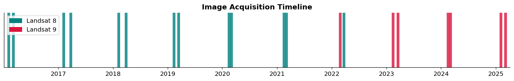
*Acquisition dates for all 10 Landsat scenes across the 2016–2025 study period.*

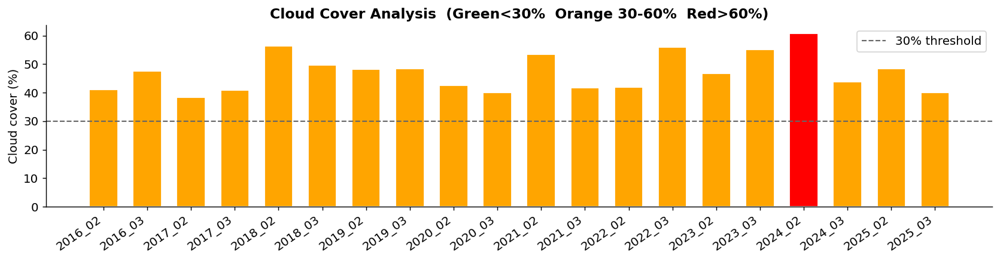
*Per-scene cloud cover percentage — scenes with high cloud fraction are automatically masked.*

---

### 🌈 True Colour & NDVI Grids
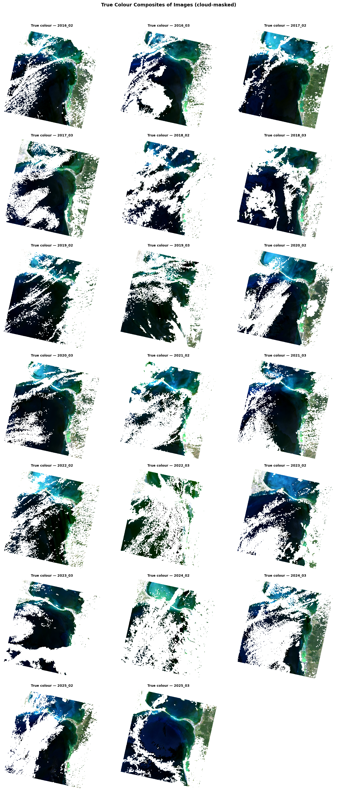
*RGB true-colour composite previews across all 10 scenes — shows visible land-cover change over time.*

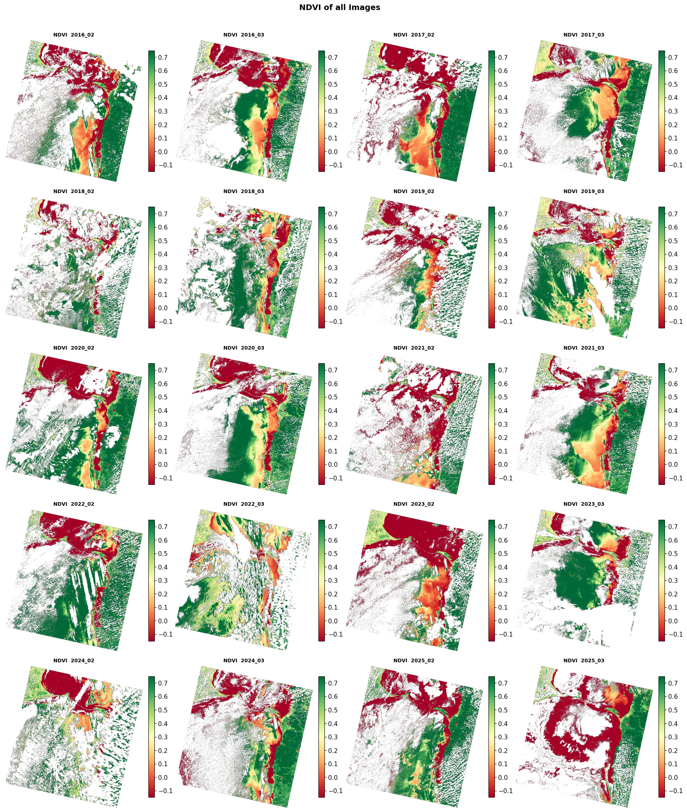
*NDVI spatial maps across all 10 scenes (Red = bare/water · Yellow = sparse vegetation · Green = dense canopy).*

---

### 📊 NDVI Spectral Distribution
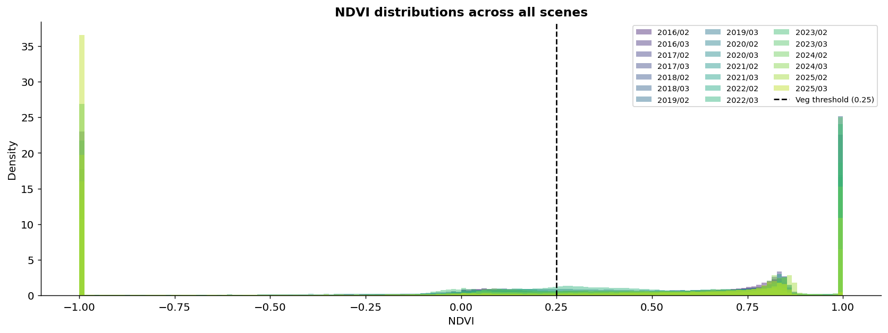
*Overlapping NDVI density distributions per scene — the leftward shift of the green peak confirms progressive canopy thinning.*

---

### 🗺️ Persistent Land Mask
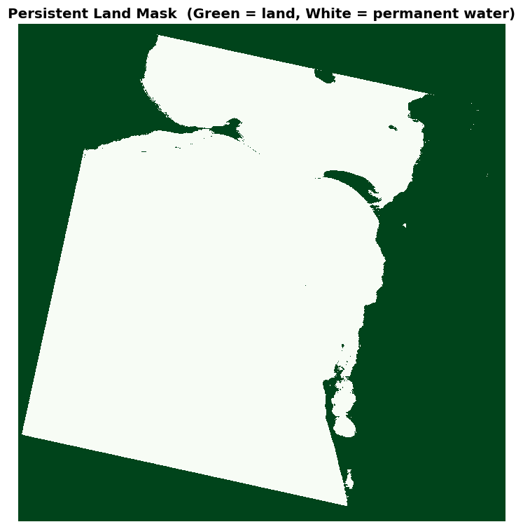
*Persistent land mask (green = confirmed land, white = permanently masked water). Shrimp ponds, salt pans and mudflats are correctly masked out to prevent skewing vegetation statistics.*

---

### 🤖 Machine Learning Evaluation
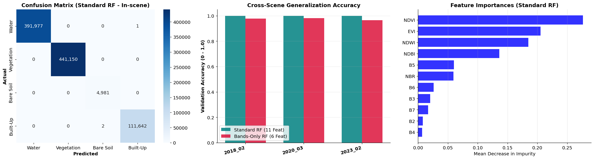
*3-panel ML dashboard: Confusion Matrix (in-scene) · Cross-scene accuracy comparison (Standard vs Bands-only RF) · Gini Feature Importances. NDVI and NDWI are consistently the top two most informative features.*

---

### 🗺️ Before vs. After Classification Maps
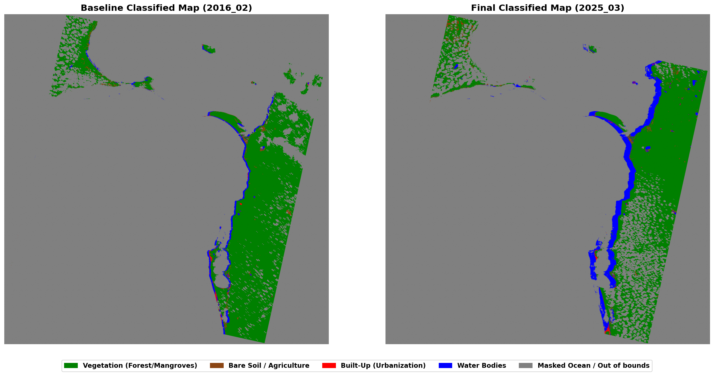
*Side-by-side classified maps: **baseline (earliest scene)** vs. **final (2025)**. Green = Vegetation · Yellow = Bare Soil · Red = Built-Up · Blue = Water · Grey = Masked.*

---

### 📈 Land Cover Trend & Change
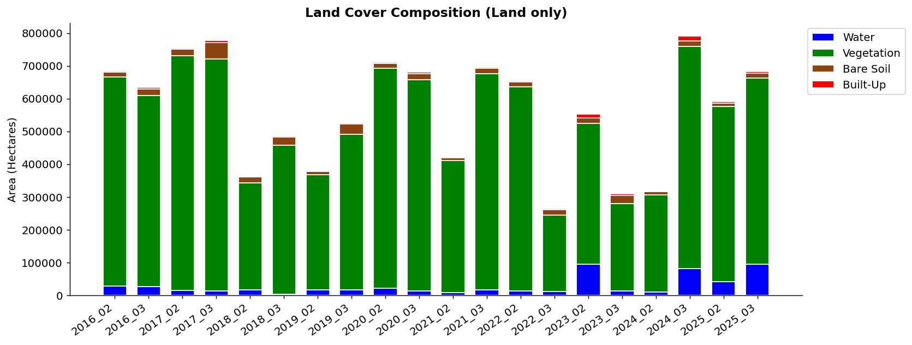
*Stacked bar chart showing the real-world hectare composition of all 4 land-cover classes across all scenes.*

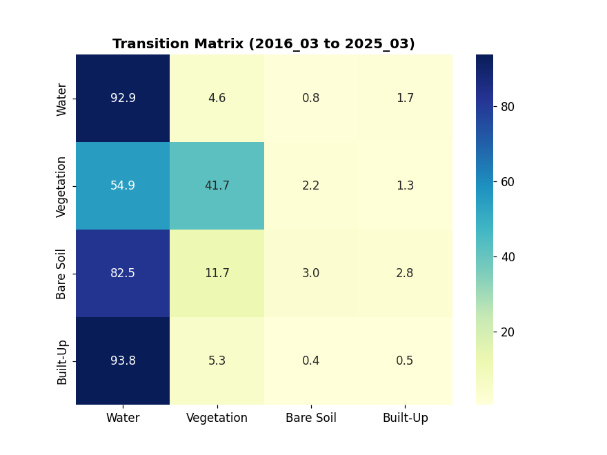
*Class-to-class transition probability heatmap — reveals the dominant conversion pathways (e.g. Vegetation → Bare Soil).*

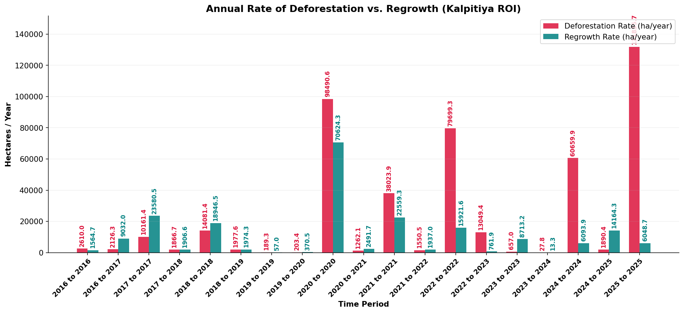
*Annualised deforestation loss (Crimson) vs. regrowth gain (Teal) in hectares per year for every consecutive scene interval.*

---

### 🔮 Forecasting Dashboard
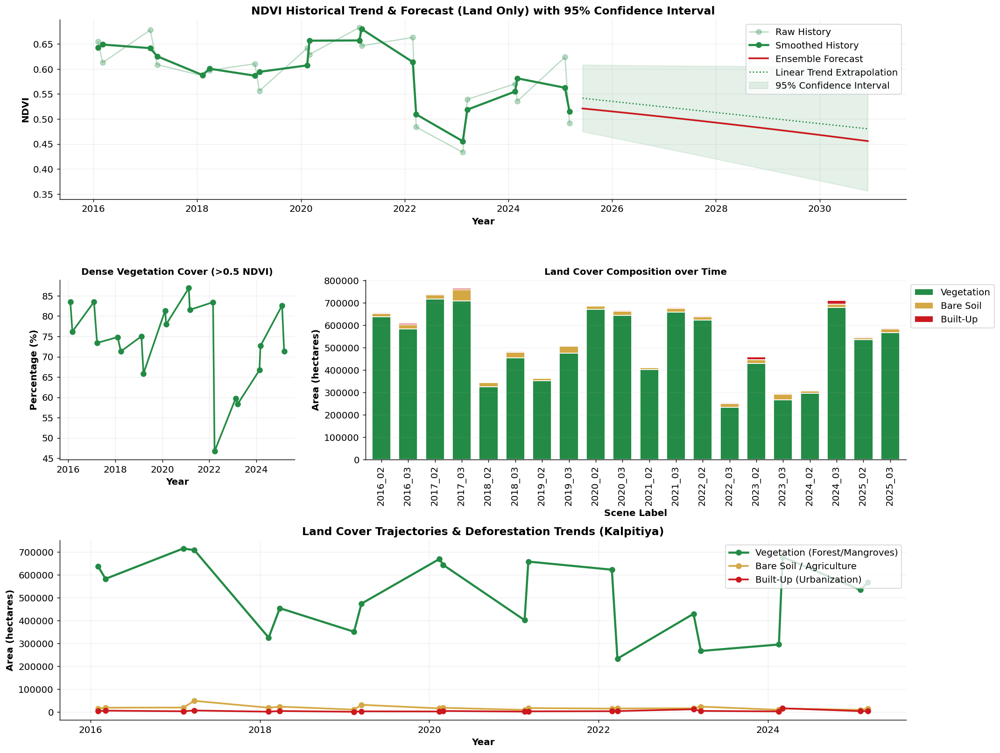
*4-panel summary dashboard: smoothed NDVI trend with ensemble forecast to 2030 + 95% CI · Dense vegetation (%) over time · Stacked land-cover composition · Absolute hectare trajectories.*

---

## 📄 License & Citation

Released under the **MIT License** — see [`LICENSE`](LICENSE) for details.

If you use this repository in a publication or academic work, please cite:

```bibtex
@misc{heyisula2026,
  author       = {Isula Dissanayake},
  title        = {TerraShift Sri Lanka: Kalpitiya Deforestation and Land-Cover Change Analysis (2016-2025)},
  year         = {2026},
  howpublished = {\url{https://github.com/heyisula/terraShiftSriLanka}},
  note         = {GitHub repository}
}
```

---

<div align="center">

Made with Satelite Imagery, Python and remote sensing science

**[⭐ Star this repo](https://github.com/heyisula/terraShiftSriLanka)** if you found it useful!

</div>
